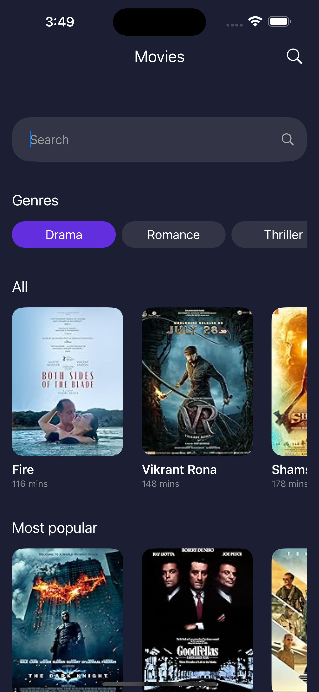

# MoviesAPP

Aplicación iOS desarrollada en SwiftUI para mostrar un listado de películas y el detalle de cada una.

## Capturas
 

## Requisitos previos
Xcode 15

## Dependencias
Se utilizó Swift Package Manager
- SwiftRealm
- Lottie

## Características
- Patrón ViewModel. La vista se encarga solo de mostrar información, el ViewModel de llamar a la API, ordenarla y persistirla.
- Router que maneja el NavigationPath y se encarga de navegación (navegación desacoplada de la vista).
- Las películas se almacenan localmente usando Realm. Si la API falla o no hay conexión, se muestran las películas previamente almacenadas. Además, se muestra un alert con mensaje de error si falla.
- Las películas se listan ordenadas por fecha (de la más reciente a la más antigua).
- La app tiene splash screen con una animación usando Lottie.
- Se piden permisos para usar la cámara y para usar el GPS. Hay una clase que se encarga de pedir estos permisos y cuando se abre la aplicación por primera vez, luego de mostrarse la splash screen se solicitan dichos permisos ni bien se renderiza la vista del listado de películas.
- Hay filtro por nombre de película y por género de película.
- Errores tipados usando un enum, con una variable con la descripción del error.
